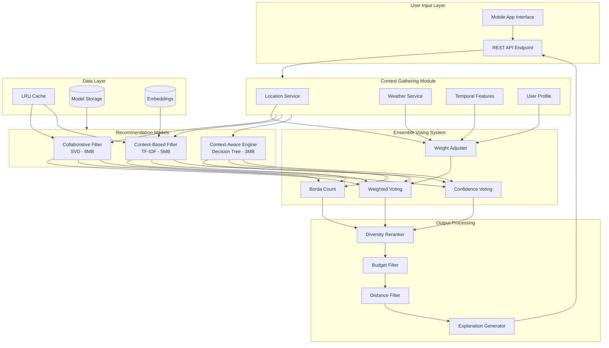

# Design Document: Lightweight Ensemble-Based Tourism Recommender System

## Overview

This design document describes the architecture and implementation of a lightweight, ensemble-based tourism recommender system for Sri Lanka. The system combines three recommendation approaches—collaborative filtering, content-based filtering, and context-aware rules—using a voting mechanism optimized for mobile deployment.

The key innovation is the dynamic weight adjustment in the ensemble voting based on contextual factors (weather, season, user type), combined with aggressive model compression techniques to achieve sub-100ms inference on mobile devices.

## Architecture



## Components and Interfaces

### 1. Data Processing Module

```python
class DataProcessor:
    """Handles raw data transformation and feature engineering."""
    
    def load_reviews(self, file_path: str) -> pd.DataFrame:
        """Load and parse review CSV files."""
        pass
    
    def extract_location_features(self, df: pd.DataFrame) -> Dict[str, LocationFeatures]:
        """Extract location metadata including coordinates, type, city."""
        pass
    
    def build_user_profiles(self, df: pd.DataFrame) -> Dict[str, UserProfile]:
        """Create user profiles from rating history."""
        pass
    
    def build_rating_matrix(self, df: pd.DataFrame) -> sparse.csr_matrix:
        """Construct user-item rating matrix with normalization."""
        pass
    
    def generate_tfidf_embeddings(self, descriptions: List[str]) -> np.ndarray:
        """Generate TF-IDF vectors for destination descriptions."""
        pass
```

### 2. Collaborative Filtering Model

```python
class CollaborativeFilter:
    """SVD-based collaborative filtering with mobile optimization."""
    
    def __init__(self, n_factors: int = 50, n_epochs: int = 20):
        self.n_factors = n_factors
        self.n_epochs = n_epochs
        self.model = None
        self.user_factors = None
        self.item_factors = None
    
    def fit(self, rating_matrix: sparse.csr_matrix) -> None:
        """Train SVD model on rating matrix."""
        pass
    
    def predict(self, user_id: str, candidate_items: List[str]) -> List[Tuple[str, float]]:
        """Generate predictions for user-item pairs."""
        pass
    
    def get_confidence(self, user_id: str) -> float:
        """Return confidence score based on user's rating history."""
        pass
    
    def compress(self, target_size_mb: float = 10.0) -> None:
        """Apply quantization and pruning for mobile deployment."""
        pass
```

### 3. Content-Based Filter

```python
class ContentBasedFilter:
    """TF-IDF based content filtering with pre-computed similarities."""
    
    def __init__(self, max_features: int = 500):
        self.max_features = max_features
        self.vectorizer = None
        self.embeddings = None
        self.similarity_matrix = None
    
    def fit(self, descriptions: List[str], attributes: Dict[str, List[str]]) -> None:
        """Build TF-IDF embeddings and similarity matrix."""
        pass
    
    def predict(self, user_preferences: Dict[str, Any], 
                candidate_items: List[str]) -> List[Tuple[str, float]]:
        """Rank destinations by preference match."""
        pass
    
    def get_similar_destinations(self, destination_id: str, k: int = 10) -> List[str]:
        """Find k most similar destinations."""
        pass
```

### 4. Context-Aware Engine

```python
class ContextAwareEngine:
    """Rule-based context processing using decision trees."""
    
    def __init__(self, max_depth: int = 10):
        self.max_depth = max_depth
        self.tree = None
        self.rules = None
    
    def fit(self, context_features: pd.DataFrame, ratings: np.ndarray) -> None:
        """Train decision tree on context-rating relationships."""
        pass
    
    def predict(self, context: Context, 
                candidate_items: List[str]) -> List[Tuple[str, float]]:
        """Score destinations based on current context."""
        pass
    
    def get_context_type(self, context: Context) -> str:
        """Classify context for weight adjustment."""
        pass
```

### 5. Ensemble Voting Module

```python
class EnsembleVotingSystem:
    """Combines model predictions using configurable voting strategies."""
    
    DEFAULT_WEIGHTS = {
        'collaborative': 0.35,
        'content_based': 0.25,
        'context_aware': 0.25,
        'neural': 0.15  # Reserved for future extension
    }
    
    CONTEXT_WEIGHT_ADJUSTMENTS = {
        'cold_start': {'collaborative': -0.20, 'content_based': +0.20},
        'weather_critical': {'context_aware': +0.15, 'neural': -0.15},
        'peak_season': {'collaborative': +0.10, 'content_based': -0.10}
    }
    
    def __init__(self, models: Dict[str, BaseModel], strategy: str = 'weighted'):
        self.models = models
        self.strategy = strategy
        self.weights = self.DEFAULT_WEIGHTS.copy()
    
    def predict(self, user_id: str, context: Context, top_k: int = 10) -> List[Recommendation]:
        """Generate ensemble predictions using selected strategy."""
        pass
    
    def weighted_voting(self, predictions: Dict[str, List[Tuple[str, float]]], 
                        context: Context) -> List[Tuple[str, float]]:
        """Combine predictions using context-adjusted weights."""
        pass
    
    def borda_count(self, ranked_lists: List[List[str]]) -> List[Tuple[str, float]]:
        """Aggregate rankings using Borda count method."""
        pass
    
    def confidence_voting(self, predictions: Dict[str, Tuple[List, float]]) -> List[Tuple[str, float]]:
        """Weight predictions by model confidence scores."""
        pass
    
    def adjust_weights(self, context: Context) -> Dict[str, float]:
        """Dynamically adjust model weights based on context."""
        pass
```

### 6. Mobile Optimizer

```python
class MobileOptimizer:
    """Handles model compression and caching for mobile deployment."""
    
    def __init__(self):
        self.destination_cache = LRUCache(maxsize=100)
        self.weather_cache = TTLCache(maxsize=20, ttl=3600)
        self.user_cache = LRUCache(maxsize=50)
    
    def quantize_model(self, model: Any, bit_width: int = 8) -> bytes:
        """Convert model to lower precision format."""
        pass
    
    def prune_model(self, model: Any, sparsity: float = 0.5) -> Any:
        """Remove low-importance weights from model."""
        pass
    
    def compress_all_models(self, models: Dict[str, Any]) -> Dict[str, bytes]:
        """Apply compression pipeline to all models."""
        pass
    
    def get_cached_recommendations(self, cache_key: str) -> Optional[List[Recommendation]]:
        """Retrieve cached recommendations if available."""
        pass
    
    def should_use_server(self, network_available: bool, 
                          on_device_latency: float) -> bool:
        """Decide whether to call server-side models."""
        pass
```

### 7. Recommendation API

```python
@dataclass
class RecommendationRequest:
    user_id: str
    location: Tuple[float, float]  # (latitude, longitude)
    budget: Optional[Tuple[float, float]] = None  # (min, max)
    travel_style: Optional[str] = None  # beach, cultural, nature, adventure
    group_size: int = 1
    max_distance_km: Optional[float] = None

@dataclass
class Recommendation:
    destination_id: str
    name: str
    score: float
    explanation: str
    distance_km: Optional[float] = None
    estimated_cost: Optional[float] = None

class RecommenderAPI:
    """Main API for generating recommendations."""
    
    def __init__(self, ensemble: EnsembleVotingSystem, optimizer: MobileOptimizer):
        self.ensemble = ensemble
        self.optimizer = optimizer
    
    def get_recommendations(self, request: RecommendationRequest) -> List[Recommendation]:
        """Generate personalized recommendations."""
        pass
    
    def apply_filters(self, recommendations: List[Recommendation], 
                      request: RecommendationRequest) -> List[Recommendation]:
        """Apply budget and distance filters."""
        pass
    
    def apply_diversity_reranking(self, recommendations: List[Recommendation], 
                                   diversity_weight: float = 0.3) -> List[Recommendation]:
        """Rerank to ensure diverse destination types."""
        pass
    
    def generate_explanation(self, recommendation: Recommendation, 
                             contributing_models: Dict[str, float]) -> str:
        """Generate human-readable explanation for recommendation."""
        pass
```

### 8. Model Serializer

```python
class ModelSerializer:
    """Handles model persistence with compression."""
    
    def save(self, model: Any, path: str, metadata: Dict[str, Any]) -> None:
        """Serialize model with metadata to compressed format."""
        pass
    
    def load(self, path: str) -> Tuple[Any, Dict[str, Any]]:
        """Deserialize model and return with metadata."""
        pass
    
    def get_model_size(self, model: Any) -> float:
        """Calculate model size in MB."""
        pass
```

## Data Models

### Core Data Structures

```python
@dataclass
class LocationFeatures:
    """Features extracted from destination data."""
    destination_id: str
    name: str
    city: str
    latitude: float
    longitude: float
    location_type: str  # beach, cultural, nature, urban
    avg_rating: float
    review_count: int
    price_range: str  # budget, mid-range, luxury
    attributes: List[str]  # surfing, historical, wildlife, etc.

@dataclass
class UserProfile:
    """User preference profile."""
    user_id: str
    rating_history: Dict[str, float]  # destination_id -> rating
    preferred_types: List[str]
    avg_rating: float
    visit_count: int
    is_cold_start: bool

@dataclass
class Context:
    """Current contextual information."""
    location: Tuple[float, float]
    weather: WeatherInfo
    season: str  # dry, monsoon, inter-monsoon
    day_of_week: int
    is_holiday: bool
    is_peak_season: bool
    user_type: str  # cold_start, regular, frequent

@dataclass
class WeatherInfo:
    """Weather data for context-aware recommendations."""
    condition: str  # sunny, cloudy, rainy, stormy
    temperature: float
    humidity: float
    precipitation_chance: float
```

### Rating Matrix Structure

```
Users (rows) × Destinations (columns)

         | Arugam Bay | Kandy | Mirissa | Galle | ...
---------|------------|-------|---------|-------|----
User_1   |    4.5     |  3.0  |   5.0   |  4.0  | ...
User_2   |    NaN     |  4.5  |   NaN   |  5.0  | ...
User_3   |    5.0     |  NaN  |   4.0   |  NaN  | ...
...      |    ...     |  ...  |   ...   |  ...  | ...

- NaN values indicate no rating (handled via matrix factorization)
- Ratings normalized to 1-5 scale
- Sparse matrix representation for memory efficiency
```

## Correctness Properties

*A property is a characteristic or behavior that should hold true across all valid executions of a system—essentially, a formal statement about what the system should do. Properties serve as the bridge between human-readable specifications and machine-verifiable correctness guarantees.*


### Property 1: Data Extraction Completeness

*For any* valid review CSV file, when loaded by the Data_Processor, the extracted location features SHALL contain all required fields (name, city, coordinates, location_type) with non-null values.

**Validates: Requirements 1.1**

### Property 2: User Profile Construction

*For any* set of user rating data, the constructed UserProfile SHALL contain rating_history, preferred_types derived from ratings, and correct is_cold_start flag based on rating count.

**Validates: Requirements 1.2**

### Property 3: TF-IDF Embedding Validity

*For any* non-empty text description, the generated TF-IDF embedding SHALL be a vector with dimensions ≤ max_features (500) and L2 norm equal to 1 (normalized).

**Validates: Requirements 1.3, 3.2**

### Property 4: Rating Matrix Normalization

*For any* rating matrix built from valid input data, all non-null values SHALL be in the range [1, 5] and the matrix SHALL be in sparse CSR format.

**Validates: Requirements 1.4**

### Property 5: Deduplication Preserves Most Recent

*For any* dataset containing duplicate user-destination pairs, after deduplication, only the entry with the most recent timestamp SHALL remain for each pair.

**Validates: Requirements 1.5**

### Property 6: Cold Start Confidence

*For any* user with fewer than 5 ratings (cold start user), the Collaborative_Filter SHALL return a confidence score of exactly 0.

**Validates: Requirements 2.5**

### Property 7: Collaborative Filter Inference Latency

*For any* prediction request to the Collaborative_Filter, the inference time SHALL be less than 50ms.

**Validates: Requirements 2.3**

### Property 8: Content-Based Similarity Range

*For any* pair of destinations, the computed cosine similarity SHALL be in the range [0, 1].

**Validates: Requirements 3.1**

### Property 9: Preference Ranking Correctness

*For any* user preference specification and destination set, destinations with matching attributes SHALL rank higher than those without matching attributes.

**Validates: Requirements 3.5**

### Property 10: Weather Context Scoring

*For any* context with rainy weather, beach/outdoor destinations SHALL receive lower scores than indoor/cultural destinations from the Context_Aware_Engine.

**Validates: Requirements 4.2, 4.3**

### Property 11: Holiday Context Boost

*For any* context where is_holiday is true, cultural destinations SHALL receive a score boost from the Context_Aware_Engine.

**Validates: Requirements 4.6**

### Property 12: Weighted Voting Correctness

*For any* set of model predictions and weights, the weighted voting result SHALL equal the sum of (prediction_score × weight) for each model, normalized.

**Validates: Requirements 5.1**

### Property 13: Borda Count Correctness

*For any* set of ranked lists, the Borda count aggregation SHALL assign points equal to (n - rank) where n is the number of items, and the final ranking SHALL be sorted by total points descending.

**Validates: Requirements 5.2**

### Property 14: Context-Based Weight Adjustment

*For any* context type (cold_start, weather_critical, peak_season), the ensemble weights SHALL be adjusted by the exact amounts specified: cold_start (+0.2 content, -0.2 collaborative), weather_critical (+0.15 context_aware), peak_season (+0.1 collaborative).

**Validates: Requirements 5.4, 5.5, 5.6**

### Property 15: Top-K Output Size

*For any* recommendation request with parameter K, the output list SHALL contain exactly min(K, available_destinations) items.

**Validates: Requirements 5.7**

### Property 16: LRU Cache Eviction

*For any* sequence of cache accesses exceeding 100 items, the least recently used item SHALL be evicted when a new item is added.

**Validates: Requirements 6.4**

### Property 17: TTL Cache Expiry

*For any* cached weather data, accessing it after 1 hour SHALL return a cache miss.

**Validates: Requirements 6.5**

### Property 18: Recommendation Output Format

*For any* recommendation in the output, it SHALL contain non-null destination_id, name, score (in range [0, 1]), and explanation string.

**Validates: Requirements 7.2**

### Property 19: Filter Application Correctness

*For any* recommendation list with budget and distance filters applied, all remaining items SHALL satisfy: budget_min ≤ estimated_cost ≤ budget_max AND distance_km ≤ max_distance.

**Validates: Requirements 7.3, 7.4**

### Property 20: Invalid User Handling

*For any* invalid or unknown user_id, the system SHALL treat the user as a cold_start user with is_cold_start = true.

**Validates: Requirements 7.5**

### Property 21: Diversity in Recommendations

*For any* recommendation list of size ≥ 5, the list SHALL contain at least 2 different destination types (e.g., beach, cultural, nature).

**Validates: Requirements 7.6**

### Property 22: Model Serialization Round-Trip

*For any* valid trained model, serializing to disk and then deserializing SHALL produce a model that generates identical predictions for the same inputs.

**Validates: Requirements 8.3**

### Property 23: Metric Computation Correctness

*For any* set of predictions and ground truth, the computed NDCG@K SHALL be in range [0, 1], Hit Rate@K SHALL be in range [0, 1], diversity score SHALL be non-negative, and coverage SHALL be in range [0, 1].

**Validates: Requirements 9.1, 9.2, 9.3, 9.4**

### Property 24: Invalid Rating Rejection

*For any* input rating outside the range [1, 5], the Data_Processor SHALL reject the entry and not include it in the rating matrix.

**Validates: Requirements 10.1**

### Property 25: No-Review Destination Handling

*For any* destination with zero reviews, it SHALL be excluded from Collaborative_Filter predictions but included in Content_Based_Filter predictions.

**Validates: Requirements 10.2**

## Error Handling

### Error Categories and Responses

| Error Type | Detection | Response | Fallback |
|------------|-----------|----------|----------|
| Invalid user_id | User not in database | Treat as cold start | Content-based recommendations |
| Invalid rating | Rating < 1 or > 5 | Reject entry, log warning | Skip entry |
| Missing coordinates | Null lat/long | Exclude from distance filter | Include without distance |
| Weather API failure | Timeout or error | Use cached data | Season-based rules |
| Model load failure | File not found/corrupt | Log error | Use remaining models |
| All models fail | No predictions generated | Return popular destinations | Static fallback list |
| Cache overflow | Size > limit | LRU eviction | Continue with eviction |
| Network timeout | > 500ms response | Use on-device only | Local predictions |

### Logging Strategy

```python
class RecommenderLogger:
    """Structured logging for debugging and monitoring."""
    
    def log_request(self, request_id: str, request: RecommendationRequest) -> None:
        """Log incoming request with timestamp."""
        pass
    
    def log_model_prediction(self, request_id: str, model_name: str, 
                             latency_ms: float, prediction_count: int) -> None:
        """Log individual model performance."""
        pass
    
    def log_error(self, request_id: str, error_type: str, 
                  error_message: str, context: Dict[str, Any]) -> None:
        """Log errors with full context for debugging."""
        pass
    
    def log_cache_stats(self, cache_name: str, hits: int, misses: int) -> None:
        """Log cache performance metrics."""
        pass
```

## Testing Strategy

### Dual Testing Approach

This system requires both unit tests and property-based tests for comprehensive coverage:

**Unit Tests** focus on:
- Specific examples demonstrating correct behavior
- Edge cases (empty inputs, single item, boundary values)
- Integration points between components
- Error conditions and fallback behavior

**Property-Based Tests** focus on:
- Universal properties that hold for all valid inputs
- Comprehensive input coverage through randomization
- Invariants that must be maintained across operations

### Property-Based Testing Configuration

- **Framework**: Hypothesis (Python)
- **Minimum iterations**: 100 per property test
- **Tag format**: `Feature: tourism-recommender-system, Property {number}: {property_text}`

### Test Categories

1. **Data Processing Tests**
   - Property tests for extraction, normalization, deduplication
   - Unit tests for specific CSV formats and edge cases

2. **Model Tests**
   - Property tests for prediction ranges, latency bounds
   - Unit tests for specific user/destination combinations

3. **Ensemble Tests**
   - Property tests for voting correctness, weight adjustment
   - Unit tests for specific context scenarios

4. **API Tests**
   - Property tests for output format, filter application
   - Unit tests for specific request/response pairs

5. **Performance Tests**
   - Property tests for latency bounds
   - Benchmark tests for model size constraints

### Test Data Generation

```python
from hypothesis import given, strategies as st

# Strategy for generating valid ratings
rating_strategy = st.floats(min_value=1.0, max_value=5.0)

# Strategy for generating user profiles
user_profile_strategy = st.builds(
    UserProfile,
    user_id=st.text(min_size=1, max_size=20),
    rating_history=st.dictionaries(
        st.text(min_size=1, max_size=20),
        rating_strategy,
        min_size=0,
        max_size=50
    ),
    preferred_types=st.lists(
        st.sampled_from(['beach', 'cultural', 'nature', 'adventure']),
        min_size=0,
        max_size=4
    )
)

# Strategy for generating contexts
context_strategy = st.builds(
    Context,
    location=st.tuples(
        st.floats(min_value=5.9, max_value=9.8),  # Sri Lanka lat range
        st.floats(min_value=79.5, max_value=81.9)  # Sri Lanka long range
    ),
    weather=weather_strategy,
    season=st.sampled_from(['dry', 'monsoon', 'inter-monsoon']),
    is_holiday=st.booleans(),
    is_peak_season=st.booleans()
)
```
